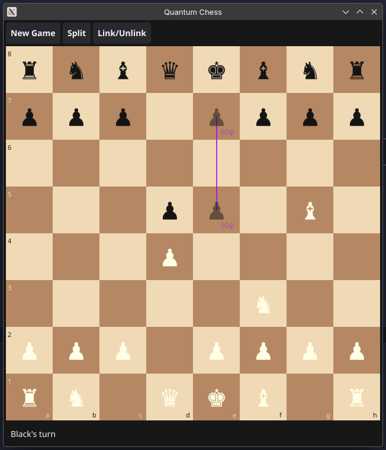

# Quantum Chess

A local two-player quantum chess game built with Go and [Fyne](https://fyne.io/). Play standard chess enriched with two quantum mechanics: **Quantum Split** (superposition) and **Entanglement**.

## Features

- **Full FIDE chess** — all pieces, sliding moves, en passant, castling (both sides), pawn auto-promotion to queen
- **Quantum Split** — place a piece into superposition across two squares instead of moving it; split again to spread further
- **King superposition** — even the king can be split across multiple squares, making its position uncertain
- **Wave function collapse** — superposed pieces collapse to a random square when observed (attacked or moved)
- **Entanglement** — link two of your own pieces so that capturing one destroys all entangled partners simultaneously
- **Entanglement graph** — pieces can participate in multiple links; unlinking a bridge that connects a chain splits it into independent groups
- **Probability display** — each ghost square shows the collapse probability (e.g. `50ψ` = 50% chance)
- **Board coordinates** — rank numbers and file letters labelled on every square edge
- **Check detection** — a warning is shown when a king is in check (the game continues; the player decides how to respond)
- **Win by capture** — the game ends when a king is physically captured, not by checkmate

## Screenshots



## How to Play

### Turn structure

Each turn has two phases:

1. **Optional free action** — link or unlink one entanglement edge (once per turn, before moving)
2. **Move** — make a normal move **or** a quantum split

### Normal move

Click a piece to select it (green highlights show legal destinations), then click a destination.

If the selected piece is in superposition, it collapses to a random square first. If it collapses away from the square you clicked, the move fails and the turn ends.

### Quantum Split

Click **Split**, then click a piece, then click a purple-highlighted destination. The piece stays at its origin _and_ a ghost copy appears at the destination — both squares are now equally likely to be the real piece.

- Splitting a piece already in superposition adds a third square (1/3 probability each), and so on
- The destination must be empty; split movement follows the same pattern as a normal non-capturing move
- Even the king can be split

### Capturing a superposed piece

When you capture a square occupied by a ghost, the target collapses first:

- If it collapses **onto** the attacked square → capture succeeds, all other ghosts vanish
- If it collapses **elsewhere** → the attacker moves onto an empty square; the piece materialises at its collapsed location

### Entanglement

Click **Link/Unlink**, then click two of your own pieces to link them. If they are already linked, the edge is removed.

- If any member of an entangled group is captured, **all other members are removed simultaneously**
- Unlinking a bridge that connects a chain splits it into two independent groups

### Reading the board

| Visual                    | Meaning                                                 |
| ------------------------- | ------------------------------------------------------- |
| Blue highlight            | Selected piece                                          |
| Green highlight           | Legal move destination                                  |
| Purple highlight          | Legal split destination                                 |
| Yellow highlight          | Piece selected for linking                              |
| Red highlight             | King in check                                           |
| Faded piece + `NNψ` label | Ghost in superposition — `NN` is collapse probability % |
| Purple lines              | Superposition group connections                         |
| Orange lines              | Entanglement edges                                      |

## Install

### Requirements

Install **[Go 1.22+](https://go.dev/dl)** and a C compiler:

#### Windows

```powershell
winget install golang.go winlibs
```

#### Linux (Arch)

```sh
sudo pacman -S go base-devel libx11 libxrandr libxinerama libxcursor libxi
```

#### Linux (Debian/Ubuntu)

```sh
sudo apt-get install golang-go build-essential libgl1-mesa-dev libx11-dev libxrandr-dev libxinerama-dev libxcursor-dev libxi-dev
```

#### macOS

```sh
brew install go
xcode-select --install
```

### Install App

#### Windows

```powershell
go install -ldflags="-H=windowsgui" github.com/Kyza/quantum_chess@latest
quantum_chess.exe
```

#### macOS & Linux

```sh
go install github.com/Kyza/quantum_chess@latest
quantum_chess
```

### Build from source

```sh
git clone https://github.com/Kyza/quantum_chess
cd quantum_chess
go run .
```

## Running Tests

```sh
go test ./...
```
